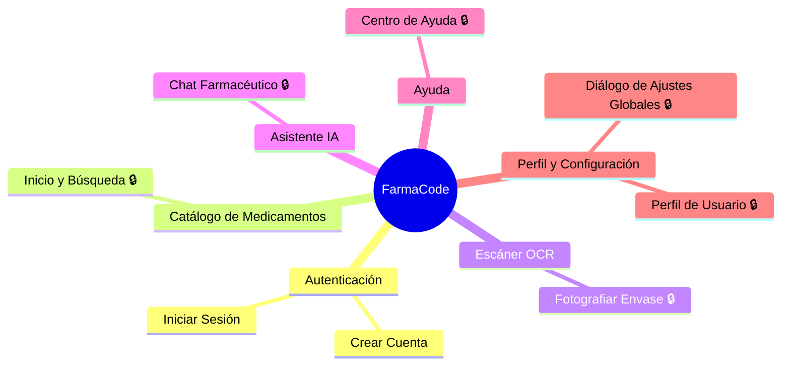

# Levantamiento Funcional — FarmaCode

> **Documento**: `Analisis_Funcional_FarmaCode.md`
> **Fecha de análisis**: 11 de Junio de 2026
> **Analista**: Asistente IA (Claude Sonnet 4.6)
> **Estado**: Pendiente validación
> **Versión del documento**: 1.0
> **Prompt utilizado**: PROMPT_levantamiento_funcional_v5.md

---

## 1. Fuentes Utilizadas

| Fuente | Disponible | Detalle |
|--------|------------|---------|
| Código fuente | ✅ | Backend Java (Spring Boot) + Frontend Kotlin (Jetpack Compose), rama `antoniochihuailaf` |
| Informe As-Is | ✅ | `Documentacion/resumen_as-is_FarmaCode.md` |
| Scripts de base de datos | ✅ | `schema.sql` (DDL completo MySQL) + `data.sql` |
| Especificaciones de API / Swagger | ✅ | Inferidas de anotaciones `@Operation` / `@Tag` en controllers Spring |
| Mapa de navegación / wireframes | ❌ | No disponible |
| Manuales de usuario | ❌ | No disponible |

---

## 2. Resumen Funcional del Sistema (Paso 1)

- **Aplicativo**: FarmaCode
- **Qué hace el sistema y para qué existe**: FarmaCode es una app móvil Android orientada al público general en Chile que permite buscar, identificar y comparar medicamentos bioequivalentes certificados por el Instituto de Salud Pública (ISP). El usuario puede fotografiar el envase de un medicamento para obtener instantáneamente alternativas genéricas de menor costo con el mismo principio activo.
- **Qué problema resuelve**: El desconocimiento sobre medicamentos genéricos equivalentes de menor precio, facilitando el acceso informado a alternativas asequibles dentro del catálogo ISP.
- **Módulos o áreas principales**:
  1. **Autenticación**: Registro e inicio de sesión locales almacenados en Room/SQLite del dispositivo. Opera completamente offline — no consume el backend para autenticar. El usuario ingresa correo y contraseña; al iniciar sesión, el sistema valida contra la BD local y guarda la sesión en `UserSession`.
  2. **Catálogo de Medicamentos**: Exploración y búsqueda del catálogo precargado en Room, con filtros por categoría terapéutica (chips horizontales) e historial de los últimos 10 escaneos recientes eliminables.
  3. **Escáner OCR**: Captura una foto del envase con CameraX, extrae texto localmente con ML Kit TextRecognition y lo envía al backend (API REST). El backend usa Gemini (Google) para identificar el principio activo y devuelve la lista de bioequivalentes ordenada por precio.
  4. **Asistente IA**: Chat conversacional que responde por reglas de palabras clave en el dispositivo — no consume IA externa ni el backend.
  5. **Ayuda**: Guía estática en 4 pasos sobre el uso de la app más glosario farmacéutico y aviso legal.
  6. **Perfil y Configuración**: Muestra datos del usuario, toggles de tema oscuro y notificaciones, y un diálogo de ajustes globales para cambiar tamaño de fuente e idioma (Español/English).
- **Tipos de usuarios**: Usuario Registrado (único rol activo); Usuario Anónimo (no implementado).
- **Descripción general**: App móvil de bioequivalentes ISP
- **CODIGO_APP**: `FACO` — derivado de FA(rma) + CO(de), las dos partes del nombre compuesto "FarmaCode". Criterio: iniciales de palabras del nombre del sistema.
- **Fecha de análisis**: 11 de Junio de 2026
- **Tecnología**: Android Kotlin 2.0.21 + Jetpack Compose (Material3) / Spring Boot 3.3.4 + Java 21 / Gemini API (gemini-2.5-flash) / Room SQLite / Retrofit 2 + OkHttp
- **Base de datos**: MySQL (Railway) — backend / Room SQLite (Android) — local
- **Propósito**: Levantamiento funcional — nuevo desarrollo en curso

---

## 3. Resumen Ejecutivo

| Indicador | Valor |
|-----------|-------|
| Total de pantallas analizadas | 8 |
| Módulos identificados | 6 |
| Roles del sistema | 2 (1 activo: Usuario Registrado) |
| Hallazgos legacy identificados | 8 |
| Distribución por prioridad | Alta: 4 / Media: 2 / Baja: 2 |
| Pantallas operativas | 8 |
| Pantallas obsoletas | 0 |
| Pantallas por confirmar | 0 |
| Reglas de negocio identificadas | 15 |
| Integraciones identificadas | 11 |
| Cobertura de fuentes | Código + As-Is + Schema SQL (100% pantallas) |

---

## 4. Tabla de Roles de Usuario (Paso 2)

| GRUPO | APLICATIVO | Actor | Rol / Perfil | Descripcion | Modulos que Utiliza | Volumen Estimado | Observacion |
|-------|------------|-------|--------------|-------------|---------------------|------------------|-------------|
| Público General Chile | FarmaCode | Usuario final | USUARIO_REGISTRADO | Persona que crea una cuenta local en la app y accede a todas las funciones: buscar medicamentos por nombre, fotografiar envases para identificarlos, revisar historial de escaneos, usar el asistente de chat y personalizar la app. | Autenticación, Catálogo de Medicamentos, Escáner OCR, Asistente IA, Ayuda, Perfil y Configuración | Por confirmar | Único rol activo en producción. La autenticación es completamente local (Room/SQLite); no existe sesión en el backend. |
| Público General Chile | FarmaCode | Usuario no registrado | USUARIO_ANONIMO | Perfil no implementado. La app actual requiere registro y login local para acceder a cualquier pantalla distinta de Autenticación. | Ninguno (acceso bloqueado) | Por confirmar | No funcional en la versión actual. El backend puede registrar búsquedas sin usuario asociado (historial anónimo), pero el frontend exige login previo. |

---

## 5. Tabla de Módulos y Pantallas (Paso 3)

| ID | GRUPO | APLICATIVO | MODULO | FUNCIONALIDAD | Flujo Navegacion Visual | OPCION / PANTALLA | PANTALLA VISUALIZADA | RUTA TECNICA | COMENTARIO | Accion | Estado | Prioridad | Dependencias | Fuente |
|----|-------|------------|--------|---------------|------------------------|-------------------|---------------------|--------------|------------|--------|--------|-----------|--------------|--------|
| FACO-AUTH-001 | Público General Chile | FarmaCode | Autenticación | Inicio de sesión local con credenciales registradas en el dispositivo | Pantalla inicial de la app | Iniciar Sesión | Pantalla de Inicio de Sesión | `"login"` | Pantalla de entrada al sistema. Muestra logo, campo correo electrónico y contraseña (toggle visibilidad), botón "Ingresar" y enlace a Registro. Valida formato de email con `android.util.Patterns.EMAIL_ADDRESS`. Muestra error inline si las credenciales no coinciden. El enlace "¿Olvidaste tu contraseña?" existe pero NO está implementado (TODO en código). Soporta múltiples idiomas por variable de estado en runtime (language == "English"). | Lectura y Escritura | Operativa | Alta | Requiere: Base de datos local Room con tabla `user` inicializada Navega a: `"home"` (login exitoso), `"register"` (enlace "Regístrate") Invoca: `UserRepository.getUserByEmail(email)` (consulta Room local) Integra con: Room SQLite (verificación de credenciales locales) | Codigo + As-Is |
| FACO-AUTH-002 | Público General Chile | FarmaCode | Autenticación | Registro de nueva cuenta local en el dispositivo | Pantalla de Inicio de Sesión → "Regístrate" | Crear Cuenta | Pantalla de Registro de Usuario | `"register"` | Formulario con 4 campos: nombre completo, correo electrónico, contraseña y confirmación de contraseña (ambas con toggle visibilidad). Valida: todos los campos obligatorios, formato email, contraseña ≥ 6 caracteres, contraseñas coincidentes y email no duplicado. Al completarse redirige a Login. Soporta múltiples idiomas por variable de estado en runtime (language == "English"). | Lectura y Escritura | Operativa | Alta | Requiere: Base de datos local Room con tabla `user` inicializada Navega a: `"login"` (registro exitoso o "Inicia sesión") Invoca: `UserRepository.getUserByEmail(email)` (verificar duplicados), `UserRepository.insertUser(user)` (insertar nuevo usuario) Integra con: Room SQLite (persistencia de la cuenta) | Codigo + As-Is |
| FACO-CAT-001 | Público General Chile | FarmaCode | Catálogo de Medicamentos | Exploración, búsqueda y filtrado del catálogo de medicamentos certificados ISP, con historial de escaneos recientes | Barra de navegación inferior → "Inicio" | Inicio / Catálogo | Pantalla de Inicio y Búsqueda | `"home"` | Pantalla principal post-login. Header verde con logo, subtítulo "Medicamentos certificados ISP", barra de búsqueda (texto libre) y toggle de tema. Chips de filtro por categoría terapéutica (scroll horizontal, sticky). Lista scrollable de tarjetas MedicationCard. Sección "Últimos escaneados" con los últimos escaneos guardados en Room (eliminables). Al seleccionar un medicamento abre ModalBottomSheet con detalle y alternativas bioequivalentes (MedicationDetailDialog, sin ruta propia). Soporta múltiples idiomas por variable de estado en runtime (language == "English"). | Lectura y Escritura | Operativa | Alta | Requiere: Sesión activa (UserSession.userEmail), datos de medicamentos precargados en Room Navega a: ModalBottomSheet de detalle (sin ruta propia, estado local) Invoca: `MedicationRepository.getAllMedication()`, `searchMedications(query)`, `getMedicationsByCategory(category)`, `getAlternatives(principioActivo, id)`, `getRecentScans()`, `deleteScanHistory(scan)` (todas consultas Room local) Integra con: Room SQLite (catálogo local, historial de escaneos) | Codigo + As-Is |
| FACO-SCAN-001 | Público General Chile | FarmaCode | Escáner OCR | Identificación de medicamento por fotografía del envase usando OCR y Gemini AI | Barra de navegación inferior → "Scanner" | Escáner OCR | Pantalla de Fotografiar Envase | `"scanner"` | Solicita permiso de cámara al entrar. Muestra preview en tiempo real de la cámara trasera (CameraX). Header flotante verde con instrucción "Apunta al envase y presiona el botón". Botón circular de captura en la parte inferior. Al presionar: captura foto con CameraX ImageCapture, escala la imagen a máximo 1024px, codifica en Base64 (JPEG 75%), extrae texto localmente con ML Kit TextRecognition y llama a `buscarPorOcr(texto, imagenBase64)` vía Retrofit al backend. Muestra overlay de carga y mensajes de error. Resultados en ModalBottomSheet (MedicationDetailDialog, sin ruta propia). Soporta múltiples idiomas por variable de estado en runtime (language == "English"). | Lectura y Escritura | Operativa | Alta | Requiere: Permiso `android.permission.CAMERA` concedido, sesión activa, conectividad a internet para llamada al backend Navega a: ModalBottomSheet de resultado (sin ruta propia, estado local) Invoca: `BusquedaApiService.buscarPorOcr(OcrRequest(texto, imagenBase64))` (Retrofit POST al backend), `MedicationRepository.saveScanHistory(scan)` (Room) Integra con: ML Kit TextRecognition (OCR on-device), CameraX (captura de foto), Backend Railway (identificación IA), Gemini API via Backend (análisis texto/imagen) | Codigo + As-Is |
| FACO-CHAT-001 | Público General Chile | FarmaCode | Asistente IA | Consultas en lenguaje natural sobre medicamentos mediante chatbot por palabras clave | Barra de navegación inferior → "Chat" | Chat IA | Pantalla de Chat Farmacéutico | `"chat"` | Interfaz de mensajería estilo chat. Header verde con icono de asistente y estado "En línea". Lista de mensajes en burbujas diferenciadas (usuario en verde, asistente en gris). Campo de texto con botón enviar. El asistente procesa mensajes localmente por palabras clave: "alternativa"/"genérico", saludos, "isp"/"certificación", y verbos de búsqueda (buscar, busca, encuentra, dime, muéstrame, cual, que es). Saluda al iniciar con mensaje de bienvenida. Sin llamadas a IA externa ni al backend. Soporta múltiples idiomas por variable de estado en runtime (language == "English"). | Lectura y Escritura | Operativa | Media | Requiere: Sesión activa Navega a: Sin navegación Invoca: `MedicationRepository.searchMedications(searchTerm)` (Room local, cuando se detectan palabras clave de búsqueda) Integra con: Room SQLite (búsqueda local de medicamentos por nombre) | Codigo + As-Is |
| FACO-HLP-001 | Público General Chile | FarmaCode | Ayuda | Guía paso a paso sobre el uso de la app y glosario de términos farmacéuticos | Barra de navegación inferior → "Ayuda" (o desde Perfil → Ayuda) | Centro de Ayuda | Pantalla de Centro de Ayuda | `"help"` | Contenido estático con scroll vertical. Header verde con título "Centro de Ayuda". Sección "Cómo usar la aplicación" con 4 tarjetas de pasos numerados (1-Buscar, 2-Escanear, 3-Ver alternativas, 4-Verificar ISP). Sección "Glosario de términos" con definiciones de Genérico, Bioequivalente, Referencia y Principio Activo. Aviso de seguridad en tarjeta ámbar: "Esta aplicación es solo informativa. Consulta siempre con un profesional de salud". Sin interacción ni llamadas externas. Soporta múltiples idiomas por variable de estado en runtime (language == "English"). | Solo Lectura | Operativa | Baja | Requiere: Sesión activa Navega a: Sin navegación Invoca: Sin llamadas externas (contenido 100% estático en código) Integra con: Sin dependencias externas | Codigo + As-Is |
| FACO-PERF-001 | Público General Chile | FarmaCode | Perfil y Configuración | Visualización de datos del usuario y controles de personalización de la app | Barra de navegación inferior → "Perfil" | Perfil | Pantalla de Perfil de Usuario | `"profile"` | Muestra avatar, nombre y correo del usuario autenticado (cargados desde Room). Sección de accesos: "Historial" (navega a Inicio) y "Ayuda". Sección "Preferencia de vista": toggle Notificaciones (sin funcionalidad implementada) y toggle Tema Oscuro. Botón "Configuración" abre el Diálogo de Ajustes Globales. Botón "Cerrar Sesión" limpia el back-stack y navega a Login. Soporta múltiples idiomas por variable de estado en runtime (language == "English"). | Lectura y Escritura | Operativa | Media | Requiere: Sesión activa (UserSession.userEmail no vacío) Navega a: `"home"` (Historial), `"help"` (Ayuda), `"login"` (Cerrar Sesión), Diálogo Ajustes (estado local) Invoca: `UserRepository.getUserByEmail(UserSession.userEmail)` (Room) Integra con: Room SQLite (datos del usuario), estado global de MainActivity (tema, idioma, fuente) | Codigo + As-Is |
| FACO-PERF-002 | Público General Chile | FarmaCode | Perfil y Configuración | Configuración global de la app: tamaño de fuente e idioma | Perfil de Usuario → botón "Configuración" | Diálogo de Ajustes Globales | Diálogo de Ajustes Globales | Sin ruta propia (modal en `"profile"`, controlado por `uiState.showSettingsCard`) | Modal Dialog con título "Ajustes Globales". Botón "Aa (N)" cambia el tamaño de fuente ciclando entre tamaños (callback `onFontSizeChange` en MainActivity). Botón de idioma muestra el idioma actual y alterna entre "Español" e "English" (callback `onLanguageChange`). Botón "Guardar y Cerrar" cierra el diálogo. Los cambios aplican inmediatamente a toda la app a través del estado hoisted en MainActivity. Soporta múltiples idiomas por variable de estado en runtime (language == "English"). | Lectura y Escritura | Operativa | Baja | Requiere: Estar en la pantalla Perfil de Usuario (FACO-PERF-001) Navega a: Cierra el diálogo (regresa a Perfil de Usuario) Invoca: Callbacks `onFontSizeChange()` y `onLanguageChange()` (estado hoisted en MainActivity, sin persistencia en BD) Integra con: Sin dependencias externas (estado volátil en memoria — se pierde al cerrar la app) | Codigo |

---

## 6. Tabla de Reglas de Negocio e Integraciones (Paso 4)

| ID | MODULO | PANTALLA | Categoria | Tipo | Descripcion | Detalle Tecnico | Estado | Fuente | Observacion |
|----|--------|----------|-----------|------|-------------|-----------------|--------|--------|-------------|
| FACO-RN-001 | Autenticación | Pantalla de Inicio de Sesión | Regla de Negocio | Validacion | El correo electrónico es obligatorio y debe tener formato válido antes de intentar el login | Validación: `state.email.isBlank()` y `android.util.Patterns.EMAIL_ADDRESS.matcher(state.email).matches()`. Mensaje de error: "Completa todos los campos" / "Email inválido" | Activo | Codigo | Aplicada en `LoginViewModel.onLoginClick()` |
| FACO-RN-002 | Autenticación | Pantalla de Inicio de Sesión | Regla de Negocio | Seguridad | Las credenciales se verifican contra la base de datos local Room sin hash de contraseña | Comparación: `user.password == state.password` (texto plano). Sin hash ni cifrado. La contraseña se almacena tal como el usuario la ingresó en el registro. | Activo | Codigo | **Riesgo de seguridad**: contraseñas en texto plano. Ver FACO-LEG-005. |
| FACO-RN-003 | Autenticación | Pantalla de Registro de Usuario | Regla de Negocio | Validacion | Todos los campos del formulario de registro son obligatorios: nombre, correo, contraseña y confirmación | Validación: `state.name.isBlank() \|\| state.email.isBlank() \|\| state.password.isBlank() \|\| state.confirmPassword.isBlank()`. Mensaje: "Debes completar todos los campos..." | Activo | Codigo | Aplicada en `RegisterViewModel.onRegisterClick()` |
| FACO-RN-004 | Autenticación | Pantalla de Registro de Usuario | Regla de Negocio | Validacion | La contraseña debe tener al menos 6 caracteres | Validación: `state.password.length < 6`. Mensaje: "La contraseña debe contener al menos 6 caracteres" | Activo | Codigo | |
| FACO-RN-005 | Autenticación | Pantalla de Registro de Usuario | Regla de Negocio | Validacion | La contraseña y la confirmación deben ser idénticas | Validación: `state.password != state.confirmPassword`. Mensaje: "Las contraseñas no coinciden" | Activo | Codigo | |
| FACO-RN-006 | Autenticación | Pantalla de Registro de Usuario | Regla de Negocio | Validacion | No se puede registrar un correo que ya existe en la base de datos local | Consulta previa: `userRepository.getUserByEmail(email)`. Si `existingUser != null` → error: "El usuario ya existe" | Activo | Codigo | |
| FACO-RN-007 | Escáner OCR | Pantalla de Fotografiar Envase | Regla de Negocio | Comportamiento | Un texto OCR se considera insuficiente y activa el fallback a análisis de imagen si cumple alguna de estas condiciones | Condición en `BusquedaService.esOcrInsuficiente()`: (1) texto en blanco, (2) menos de 15 letras en total, (3) ratio letras/longitud < 40%, (4) menos de 2 palabras con ≥4 letras consecutivas | Activo | Codigo | Cuando el OCR es insuficiente Y hay imagen Base64 disponible, el backend usa `GeminiApiService.extraerInformacionDeImagen()` en lugar de texto |
| FACO-RN-008 | Escáner OCR | Pantalla de Fotografiar Envase | Regla de Negocio | Comportamiento | Si el objeto fotografiado no es un medicamento, se muestra un mensaje específico y no se guardan resultados | Código de respuesta: `principioActivo == "NO_ES_MEDICAMENTO"`. Mensaje al usuario: "Esto no parece ser un medicamento. Apunta al envase de un medicamento." | Activo | Codigo | Tanto el frontend (ScannerViewModel) como el backend (BusquedaService) manejan esta condición |
| FACO-RN-009 | Escáner OCR | Pantalla de Fotografiar Envase | Regla de Negocio | Comportamiento | Si la imagen no es legible (Gemini no pudo extraer datos), se muestra un mensaje orientativo | Código de respuesta: `principioActivo == "IMAGEN_ILEGIBLE"`. Mensaje al usuario: "La imagen no es legible. Intenta con mejor iluminación o enfoca el envase." | Activo | Codigo | |
| FACO-RN-010 | Escáner OCR | Pantalla de Fotografiar Envase | Regla de Negocio | Comportamiento | Cada escaneo exitoso se guarda automáticamente en el historial local del dispositivo | `ScannerViewModel.saveHistory(medication)` → `repository.saveScanHistory(ScanHistory(...))`. El historial se limita a los últimos 10 registros. | Activo | Codigo + As-Is | El límite de 10 está implementado en `ScanHistoryDao` (inferido del As-Is; no leído directamente). |
| FACO-RN-011 | Catálogo de Medicamentos | Pantalla de Inicio y Búsqueda | Regla de Negocio | Comportamiento | Los resultados de bioequivalentes se ordenan por precio ascendente (de menor a mayor) | Ordenamiento: `Comparator.comparing(dto -> dto.precioActual() != null ? dto.precioActual() : BigDecimal.valueOf(Long.MAX_VALUE))`. Medicamentos sin precio vigente van al final. | Activo | Codigo | Aplicado en `BusquedaService.ejecutarBusqueda()` y en `buscarPorOcr()` |
| FACO-RN-012 | Catálogo de Medicamentos | Pantalla de Inicio y Búsqueda | Regla de Negocio | Comportamiento | Si el medicamento buscado existe exactamente en la base de datos, aparece primero en la lista de resultados | Ordenamiento compuesto: primero el medicamento con `id == foundId` (prioridad 0), luego por precio ascendente (prioridad 1). | Activo | Codigo | Aplicado en `BusquedaService.ejecutarBusqueda()` |
| FACO-RN-013 | Escáner OCR | Pantalla de Fotografiar Envase | Regla de Negocio | Comportamiento | El texto OCR con mayúsculas dominantes (>75% del texto en mayúsculas) se normaliza a Title Case antes de mostrarse | Función `String.toDisplayCase()`: cuenta letras mayúsculas; si ratio > 0.75 convierte cada palabra a capitalización de título. | Activo | Codigo | Aplicada en `ScannerViewModel` sobre campos `nombre`, `principioActivo` y `laboratorio` del resultado |
| FACO-RN-014 | Perfil y Configuración | Pantalla de Perfil de Usuario | Regla de Negocio | Comportamiento | Al cerrar sesión se eliminan todas las pantallas del back-stack y el usuario no puede volver con el botón "atrás" | `navController.navigate(Screen.Login.route) { popUpTo(0) { inclusive = true } }` — limpia la pila completa de navegación. | Activo | Codigo | |
| FACO-RN-015 | Asistente IA | Pantalla de Chat Farmacéutico | Regla de Negocio | Comportamiento | El asistente responde únicamente por reglas de palabras clave predefinidas, sin IA generativa externa | Keywords monitoreadas: "alternativa", "genérico", "hola", "buenos", "saludos", "isp", "certificación", y verbos de búsqueda (buscar, busca, encuentra, dime, muéstrame, cual, que es). Cualquier otra consulta recibe respuesta genérica de "no entendí". | Activo | Codigo | No hay integración con Gemini ni con el backend desde la pantalla de Chat |
| FACO-INT-001 | Escáner OCR | Pantalla de Fotografiar Envase | Integracion | API REST | El backend consulta a Gemini API para identificar el principio activo a partir del nombre comercial cuando el medicamento no está en la base de datos | Endpoint Gemini: `POST https://generativelanguage.googleapis.com/v1beta/models/gemini-2.5-flash:generateContent`. Auth: Bearer `GEMINI_API_KEY` (env var). thinkingBudget: 0. Invocado por `GeminiApiService.identificarPrincipioActivo(nombreComercial)`. | Activo | Codigo | Fallback cuando el medicamento no se encuentra en MySQL por nombre exacto |
| FACO-INT-002 | Escáner OCR | Pantalla de Fotografiar Envase | Integracion | API REST | El backend usa Gemini para extraer información estructurada del medicamento desde el texto OCR | Mismo endpoint Gemini. Invocado por `GeminiApiService.extraerInformacionDeOcr(textoOcr)`. Retorna record `InfoMedicamento` con: nombreComercial, principioActivo, dosis, presentacion, laboratorio, paisOrigen, viaAdministracion, descripcionGeneral. | Activo | Codigo | Activado cuando el texto OCR es suficiente y el medicamento no se encontró directamente en BD |
| FACO-INT-003 | Escáner OCR | Pantalla de Fotografiar Envase | Integracion | API REST | El backend usa Gemini Vision para analizar la imagen completa cuando el texto OCR es insuficiente | Mismo endpoint Gemini con imagen Base64 en el payload. Invocado por `GeminiApiService.extraerInformacionDeImagen(imagenBase64)`. Imagen comprimida a máximo 1024px / JPEG 75% antes del envío. | Activo | Codigo | Se activa cuando el texto OCR no supera el umbral de calidad (FACO-RN-007) |
| FACO-INT-004 | Escáner OCR | Pantalla de Fotografiar Envase | Integracion | API REST | El frontend Android se comunica con el backend Railway vía Retrofit + OkHttp con autenticación por API Key | Base URL: `https://farmacode-production-c60c.up.railway.app/`. Header: `X-Api-Key: farmacode-secret-2026` (hardcoded en `RetrofitClient.kt`). Timeouts: connect 30s, read 60s, write 30s. Endpoint activo: `POST /api/busqueda/ocr`. | Activo | Codigo | La API Key está hardcodeada en el cliente Android — riesgo de seguridad si el código se descompila. Ver FACO-LEG-006. |
| FACO-INT-005 | Escáner OCR | Pantalla de Fotografiar Envase | Integracion | Autenticacion | El backend valida la API Key en todos los endpoints excepto Swagger y raíz | `ApiKeyFilter` (OncePerRequestFilter): compara header `X-Api-Key` con env var `APP_API_KEY`. Rutas excluidas: `/swagger-ui/**`, `/v3/api-docs/**`, `/`. Respuesta de rechazo: HTTP 401 + JSON `{"error": "Unauthorized", "message": "API Key inválida o ausente"}`. Dev mode: si `APP_API_KEY` está vacío, todas las peticiones pasan. | Activo | Codigo | |
| FACO-INT-006 | Catálogo de Medicamentos | Pantalla de Inicio y Búsqueda | Integracion | Base de Datos externa | La app Android almacena y consulta el catálogo de medicamentos, usuarios y escaneos en Room SQLite local | Room DB v2: tablas `medication`, `user`, `scan_history`. Versión de schema Room: 2. DAOs: `MedicationDao`, `UserDao`, `ScanHistoryDao`. Repository: `MedicationRepository`. | Activo | Codigo + As-Is | El catálogo de medicamentos está precargado en Room; la app no descarga el catálogo del backend en tiempo real. |
| FACO-INT-007 | Escáner OCR | Pantalla de Fotografiar Envase | Integracion | API REST | ML Kit TextRecognition extrae texto del envase localmente en el dispositivo antes de enviarlo al backend | SDK: `com.google.mlkit:text-recognition`. Cliente: `TextRecognition.getClient(TextRecognizerOptions.DEFAULT_OPTIONS)`. Entrada: `InputImage.fromBitmap(bitmap, rotation)`. Salida: texto crudo string. Opera completamente offline. | Activo | Codigo + As-Is | Si ML Kit falla, se llama `viewModel.setError(...)` — no hay fallback sin texto |
| FACO-INT-008 | Escáner OCR | Pantalla de Fotografiar Envase | Integracion | API REST | CameraX captura la foto del envase en el dispositivo | Use cases: `Preview` (preview en tiempo real) + `ImageCapture` (captura en MINIMIZE_LATENCY mode). Cámara: `CameraSelector.DEFAULT_BACK_CAMERA`. Callback: `ImageCapture.OnImageCapturedCallback` con `ImageProxy.toBitmap()`. | Activo | Codigo + As-Is | |
| FACO-INT-009 | Todos | Pantalla de Inicio y Búsqueda | Integracion | Base de Datos externa | El backend almacena el catálogo de medicamentos, laboratorios, principios activos, precios e historial de búsquedas en MySQL | MySQL en Railway (cloud). Schema: 6 tablas: `principio_activo`, `laboratorio`, `medicamento`, `precio`, `usuario`, `historial_busqueda`. Acceso via Spring Data JPA + Hibernate. | Activo | Codigo + As-Is | |
| FACO-INT-010 | Todos | N/A (infraestructura) | Integracion | API REST | SpringDoc OpenAPI / Swagger UI expone la documentación interactiva de la API REST | Disponible en `/swagger-ui/index.html` y `/v3/api-docs`. Versión: `springdoc-openapi-starter-webmvc-ui 2.6.0`. Excluido del filtro de API Key. | Activo | Codigo | Útil para pruebas manuales de endpoints sin pasar por el cliente Android |
| FACO-INT-011 | Catálogo de Medicamentos | Pantalla de Inicio y Búsqueda | Integracion | Base de Datos externa | El historial de búsquedas del backend usa un userId hardcoded porque no hay autenticación activa en el servidor | `HistorialController.HARDCODED_USER_ID = 1L`. Todos los registros de `historial_busqueda` se asocian al usuario con `id=1`. | Activo | Codigo | Comentario explícito en el código: "Cuando se implemente Spring Security + JWT, se reemplazará por el usuario del contexto." Ver FACO-LEG-004. |

---

## 7. Mapa de Navegación (Paso 5)

### Diagrama Mermaid

> 🔒 = Requiere sesión activa (login previo). Las pantallas de Autenticación son las únicas accesibles sin sesión — son el `startDestination` del NavHost.

### Tabla de Rutas

| Ruta | Componente / Screen | Accion / Vista | Requiere Permiso |
|------|---------------------|----------------|-----------------|
| `"login"` (startDestination) | `LoginScreen` | Inicio de sesión con correo y contraseña | No — pantalla pública de entrada |
| `"register"` | `RegisterScreen` | Registro de nueva cuenta local | No — pantalla pública |
| `"home"` | `HomeScreen` | Catálogo de medicamentos, búsqueda y historial de escaneos | Sí — sesión activa (UserSession) |
| `"scanner"` | `ScannerScreen` | Escáner OCR de envase con cámara | Sí — sesión activa + permiso CAMERA del dispositivo |
| `"chat"` | `ChatScreen` | Chat conversacional farmacéutico | Sí — sesión activa |
| `"help"` | `HelpScreen` | Centro de ayuda estático | Sí — sesión activa |
| `"profile"` | `ProfileScreen` | Perfil de usuario y configuración | Sí — sesión activa |
| Sin ruta (modal estado `showSettingsCard`) | `Dialog` en `ProfileScreen` | Diálogo de ajustes globales (fuente e idioma) | Sí — accesible desde Perfil |

> **Nota de consistencia**: Toda pantalla listada en el Paso 3 aparece en este mapa. El BottomNavBar muestra 5 ítems: Inicio, Scanner, Chat, Ayuda, Perfil. Login y Registro no tienen BottomNavBar (excluidos en `screensWithoutBottomBar`).

---

## 8. Hallazgos de Código Legacy (Paso 6)

| ID | Tipo | Ubicacion | Descripcion | Impacto Funcional | Recomendacion |
|----|------|-----------|-------------|-------------------|---------------|
| FACO-LEG-001 | Dependencia sin uso | `Producto/Backend_FarmaCode/src/main/java/com/farmacode/backend/service/external/ClaudeApiService.java` | Servicio completo de integración con la Claude API de Anthropic. Está compilado en el proyecto pero ningún otro servicio lo llama — fue reemplazado por `GeminiApiService`. | Sin impacto (código muerto) | Eliminar — el bean Spring no está siendo inyectado en ningún lugar del proyecto actual |
| FACO-LEG-002 | Feature flag desactivado | `Producto/Backend_FarmaCode/src/main/resources/application.properties` | Variables de configuración de Claude API (`claude.api.key`, `claude.api.url`, `claude.api.model`) aún presentes y referenciadas en `ClaudeApiService`, aunque el servicio no se usa. Comentado en el archivo como "desactivado — se usa Gemini". | Sin impacto (ClaudeApiService no se inyecta) | Eliminar las propiedades junto con `ClaudeApiService.java` |
| FACO-LEG-003 | Otro | `Producto/Backend_FarmaCode/src/main/java/com/farmacode/backend/controller/BusquedaController.java` | Comentarios Javadoc y descripciones `@Operation` de Swagger aún mencionan "Claude API" en los endpoints (línea 39-40: "consulta Claude API para identificar el principio activo"). El backend usa Gemini, no Claude. | Sin impacto funcional — solo afecta la documentación Swagger expuesta | Actualizar los comentarios y descripciones `@Operation` para reflejar el uso de Gemini |
| FACO-LEG-004 | Otro | `Producto/Backend_FarmaCode/src/main/java/com/farmacode/backend/controller/HistorialController.java` | `HARDCODED_USER_ID = 1L` — el historial de búsquedas del backend se asocia siempre al usuario con id=1, sin autenticación real. Comentario explícito indica que se reemplazará cuando se implemente Spring Security + JWT. | Requiere validación — el historial backend no está segregado por usuario; todos los registros se solapan en un único usuario | Implementar Spring Security + JWT y reemplazar el userId hardcoded por el usuario del contexto de seguridad |
| FACO-LEG-005 | Otro | `Producto/FarmaCode-Frontend/app/src/main/java/com/farmacox/farmacode/viewmodel/LoginViewModel.kt` (línea 51) y `RegisterViewModel.kt` (línea 74) | Las contraseñas se almacenan en Room SQLite y se comparan en texto plano (`user.password == state.password`). No hay hashing (bcrypt, Argon2, etc.). | Requiere validación — si el dispositivo es rooteado o la BD Room es accesible, las contraseñas quedan expuestas | Aplicar hashing de contraseñas (ej. `BCrypt`) antes de almacenar y al comparar en `LoginViewModel` |
| FACO-LEG-006 | Otro | `Producto/FarmaCode-Frontend/app/src/main/java/com/farmacox/farmacode/data/network/RetrofitClient.kt` (línea con `X-Api-Key`) | La API Key del backend (`farmacode-secret-2026`) está hardcodeada como literal en el código fuente del cliente Android. Cualquier persona que descompile el APK puede obtenerla. | Requiere validación — exposición de la API Key en texto plano en el APK | Mover la API Key a `local.properties` + BuildConfig o usar cifrado en reposo; rotar la clave de inmediato si el APK es distribuido públicamente |
| FACO-LEG-007 | Pantalla obsoleta | `Producto/FarmaCode-Frontend/app/src/main/java/com/farmacox/farmacode/ui/theme/screens/HelpScreen.kt` (paso 2 del tutorial) | El texto del paso 2 de la guía dice "Escanear código" y describe "leer el código de barras del medicamento". La funcionalidad actual es OCR de texto en envase, no lectura de código de barras. Texto desactualizado heredado del flujo original (ML Kit BarcodeScanning, reemplazado por TextRecognition). | Sin impacto funcional — solo afecta la guía de usuario en la pantalla de Ayuda | Actualizar el texto del paso 2 para describir correctamente la funcionalidad OCR actual |
| FACO-LEG-008 | Otro | `Producto/Backend_FarmaCode/src/main/resources/schema.sql` vs `BusquedaService.java` | La tabla `historial_busqueda` define el ENUM de `tipo_busqueda` como `('MANUAL','OCR')` en `schema.sql`. Sin embargo, `BusquedaService.java` usa `TipoBusqueda.FOTO` al guardar historial del endpoint `/api/busqueda/foto`. Si ese endpoint es invocado, el valor `FOTO` podría causar un error de restricción de BD. | Requiere validación — posible `DataIntegrityViolationException` si se llama `/api/busqueda/foto` en producción | Agregar `'FOTO'` al ENUM en `schema.sql` y verificar si el endpoint `/api/busqueda/foto` está en scope del proyecto |

---

## 9. Dudas y Pendientes (Paso 7)

### ❓ DUDAS ABIERTAS

### 🔴 CRÍTICAS (Bloquean casos de prueba)

**Autenticación**
- ¿La función "¿Olvidaste tu contraseña?" tiene fecha de implementación? Actualmente el código tiene `/* TODO: recuperar contraseña */` sin ninguna lógica. Si se incluye en el scope de pruebas, bloqueará los casos de prueba de recuperación.
- ¿Las contraseñas serán hasheadas antes de la entrega final? La implementación actual en texto plano impide diseñar casos de prueba para autenticación segura.

**Backend / Historial**
- ¿El userId hardcodeado `= 1L` en `HistorialController` es aceptable para la entrega del proyecto? Si se planea tener múltiples usuarios, los casos de prueba del historial no reflejan la segregación real.

### 🟡 IMPORTANTES (Afectan casos de prueba)

**Escáner OCR**
- ¿El endpoint `/api/busqueda/foto` (buscarPorFoto) está en el alcance de la entrega? No hay pantalla ni llamada en el frontend actual. Si se descarta, el servicio backend y el DTO `FotoRequestDTO` son código muerto.
- ¿El endpoint `/api/busqueda/nombre-comercial` (buscarPorNombreComercial) será expuesto desde el frontend en algún momento? Actualmente el frontend solo usa `/api/busqueda/ocr`.

**Catálogo de Medicamentos**
- ¿Cómo se carga el catálogo de medicamentos en Room? La app lee datos de Room local, pero no se observa una sincronización automática con el backend MySQL. ¿El catálogo viene pre-instalado con la app o hay un mecanismo de sincronización no visto en el código analizado?
- ¿El límite de 10 registros en el historial de escaneos está definido en `ScanHistoryDao` (consulta con `LIMIT 10`) o se trunca de otra forma?

**Notificaciones**
- ¿El toggle de Notificaciones en Perfil tiene funcionalidad planificada? Actualmente `viewModel.toggleNotificacions(it)` guarda el estado pero no hay lógica de notificaciones real en el código.

### 🟢 INFORMATIVAS (No bloquean)

**Configuración**
- ¿El tamaño de fuente y el idioma se persisten al cerrar la app? El estado actual es en memoria (MainActivity state) y se pierde al cerrar. ¿Se planea guardar en SharedPreferences o Room?
- ¿Se eliminará definitivamente `ClaudeApiService.java` o se mantiene como respaldo?
- ¿Hay un glosario de categorías terapéuticas definido? El catálogo muestra categorías como "Analgésicos", "Antibióticos" con traducción hardcodeada; si se agregan nuevas categorías en la BD, no tendrán traducción en inglés.

---

## 📝 Notas Importantes

### Hallazgos Relevantes
- El catálogo de medicamentos se maneja enteramente en Room SQLite local: la app Android NO realiza llamadas al backend para listar ni buscar medicamentos. El backend MySQL y los endpoints de `/api/medicamentos` existen pero no son consumidos directamente por el cliente Android.
- La única llamada activa del frontend al backend es `POST /api/busqueda/ocr` en el flujo del escáner.
- El módulo de Chat es completamente local y autónomo: no usa Gemini, no usa el backend, responde por palabras clave predefinidas en `ChatViewModel`.

### Consideraciones Técnicas
- El estado de idioma y tema se maneja como estado hoisted en `MainActivity` y se propaga como parámetro a través del árbol de composables — no hay Context Provider ni SharedPreferences. Esto significa que los cambios de idioma son inmediatos pero no persisten entre sesiones.
- La sesión de usuario se gestiona a través del objeto `UserSession` (singleton en Kotlin) con campo `userEmail`. Es estado en memoria; no hay token JWT ni sesión en el backend.

### Riesgos Identificados
- **Seguridad de contraseñas**: almacenamiento en texto plano en Room (FACO-LEG-005) y API Key hardcodeada en el APK (FACO-LEG-006) son los dos riesgos de seguridad más relevantes antes de distribución pública.
- **Discrepancia schema vs código**: `TipoBusqueda.FOTO` usado en el código Java no está en el ENUM del DDL SQL (FACO-LEG-008) — puede causar errores silenciosos en producción.

---

## 10. Glosario de Términos del Negocio (Paso 8)

| Término | Definición |
|---------|------------|
| Principio Activo | Sustancia química responsable del efecto terapéutico de un medicamento. Es el componente que "hace el trabajo" clínico. Dos medicamentos con el mismo principio activo tienen el mismo efecto en el cuerpo. |
| Bioequivalente | Medicamento que demuestra tener la misma biodisponibilidad (velocidad y cantidad de principio activo absorbido) que el medicamento de referencia, garantizando el mismo efecto terapéutico. |
| Genérico | Medicamento que contiene el mismo principio activo que el de referencia pero puede variar en excipientes y presentación. A diferencia del bioequivalente, no siempre requiere estudios de biodisponibilidad. |
| Medicamento de Referencia | Medicamento original, registrado con documentación científica completa sobre su eficacia, seguridad y calidad. Es el estándar contra el que se comparan los bioequivalentes y genéricos. |
| ISP | Instituto de Salud Pública de Chile. Organismo regulador que certifica la calidad, seguridad y eficacia de los medicamentos comercializados en Chile. |
| Certificación ISP | Aval otorgado por el ISP que garantiza que el medicamento cumple con los estándares chilenos de calidad. En FarmaCode, el campo `certificacionISP` (boolean) indica si el medicamento está certificado. |
| Categoría Terapéutica | Clasificación del medicamento según su uso clínico y el sistema del cuerpo que trata (ej: Analgésicos, Antibióticos, Antiinflamatorios). Usada como filtro en el catálogo. |
| Dosis | Cantidad de principio activo por unidad del medicamento, expresada en mg, mcg, ml, g, UI o IU (ej: "500 mg"). Permite identificar la potencia del medicamento. |
| Presentación | Forma farmacéutica del medicamento: comprimidos, cápsulas, jarabe, inyectable, crema, etc. Puede incluir la cantidad de unidades por envase. |
| Laboratorio | Empresa farmacéutica fabricante del medicamento. Cada medicamento en FarmaCode tiene asociado un laboratorio con nombre y país de origen. |
| Historial de Escaneos | Registro de los últimos 10 medicamentos identificados por OCR en la app. Se almacena localmente en Room (tabla `scan_history`) y se muestra en la pantalla de Inicio. |
| OCR | Reconocimiento Óptico de Caracteres. Tecnología que extrae texto de imágenes fotográficas. FarmaCode usa ML Kit TextRecognition para OCR on-device del envase del medicamento. |
| Bioavailabilidad (Biodisponibilidad) | Fracción del medicamento que llega a la circulación sistémica del cuerpo en forma activa y la velocidad con que lo hace. Criterio técnico para certificar bioequivalencia. |
| Escáner OCR | Función de la app que toma una fotografía del envase de un medicamento y extrae automáticamente el texto para identificar el principio activo y sus alternativas bioequivalentes. |
| Nombre Comercial | Nombre registrado y patentado por el laboratorio fabricante para un medicamento (ej: "Tapsin", "Aspirina"). A diferencia del principio activo, varía entre fabricantes. |
| Gemini | Servicio de Inteligencia Artificial de Google (modelo `gemini-2.5-flash`) utilizado por el backend de FarmaCode para identificar medicamentos a partir de texto OCR e imágenes. |
| Railway | Plataforma cloud (PaaS) donde se despliega el backend Spring Boot y la base de datos MySQL de FarmaCode. URL de producción: `https://farmacode-production-c60c.up.railway.app/`. |
| API Key | Clave de autenticación (`X-Api-Key`) que el cliente Android debe incluir en cada petición al backend para comprobar que la solicitud proviene de FarmaCode. |

---

## 11. Próximos Pasos

1. **Validación con usuarios**: Agendar sesiones de revisión con el equipo del proyecto para validar que las 8 pantallas documentadas y sus funcionalidades coinciden con el diseño esperado.
2. **Resolución de dudas críticas**: Priorizar las 3 preguntas críticas (recuperación de contraseña, hashing de contraseñas, userId hardcodeado) antes de generar casos de prueba.
3. **Generación del Diagrama Swimlane**: Usar `PROMPT_swimlane_v1.md` con este documento como insumo para mapear el flujo completo del proceso de identificación de medicamento (escaneo → OCR → backend → Gemini → resultado).
4. **Corrección de hallazgos de seguridad**: Abordar FACO-LEG-005 (contraseñas en texto plano) y FACO-LEG-006 (API Key hardcodeada) antes de cualquier distribución pública del APK.
5. **Generación de casos de prueba**: Una vez validado este documento y resueltas las dudas críticas.

---

*Documento generado: 11 de Junio de 2026 | Analista: Asistente IA | Prompt: PROMPT_levantamiento_funcional_v5.md*
