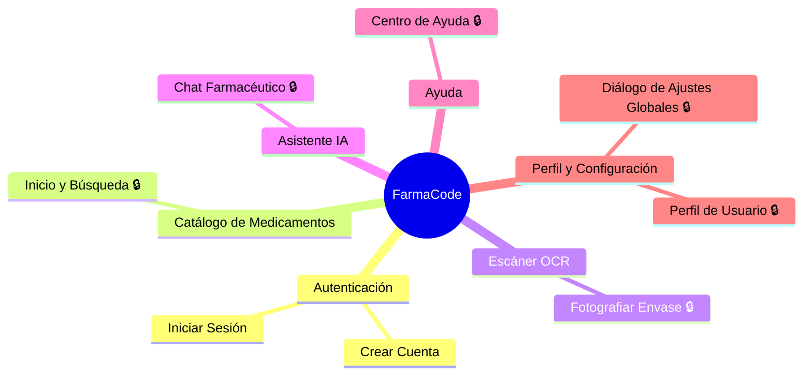

# Mapa de Navegación — FarmaCode

> **Sistema**: FarmaCode | **CODIGO_APP**: FACO | **Fecha**: 11 de Junio de 2026
> **Rama analizada**: `antoniochihuailaf`

---

## Diagrama Mermaid (mindmap)

> **Leyenda**: 🔒 = Requiere sesión activa (login previo). Las pantallas de Autenticación no tienen 🔒 — son el punto de entrada público de la app.

---

## Tabla de Rutas

| Ruta | Componente / Screen | Accion / Vista | Requiere Permiso |
|------|---------------------|----------------|-----------------|
| `"login"` (startDestination) | `LoginScreen` (`LoginScreen.kt`) | Pantalla de inicio de sesión con correo y contraseña. Valida credenciales contra Room local. | No — pantalla pública de entrada |
| `"register"` | `RegisterScreen` (`RegisterScreen.kt`) | Formulario de registro de nueva cuenta local (nombre, correo, contraseña, confirmación). | No — pantalla pública |
| `"home"` | `HomeScreen` (`HomeScreen.kt`) | Catálogo de medicamentos con búsqueda, filtros de categoría e historial de escaneos recientes. | Sí — sesión activa (UserSession.userEmail no vacío) |
| `"scanner"` | `ScannerScreen` (`ScannerScreen.kt`) | Cámara en tiempo real para fotografiar envase. OCR local + llamada al backend para identificar principio activo. | Sí — sesión activa + permiso `android.permission.CAMERA` |
| `"chat"` | `ChatScreen` (`ChatScreen.kt`) | Chat farmacéutico por palabras clave (local, sin IA externa). | Sí — sesión activa |
| `"help"` | `HelpScreen` (`HelpScreen.kt`) | Guía de 4 pasos, glosario farmacéutico y aviso de seguridad. Contenido 100% estático. | Sí — sesión activa |
| `"profile"` | `ProfileScreen` (`ProfileScreen.kt`) | Datos del usuario, toggles de tema y notificaciones, accesos a historial y ayuda, cerrar sesión. | Sí — sesión activa |
| Sin ruta (modal `showSettingsCard == true`) | `Dialog` dentro de `ProfileScreen` | Diálogo de ajustes globales: tamaño de fuente (ciclar) e idioma (Español / English). | Sí — accesible solo desde Perfil de Usuario |

---

## Flujos de Navegación Principales

### Flujo 1 — Onboarding (primer uso)
`login` → (botón "Regístrate") → `register` → (registro exitoso) → `login` → (login exitoso) → `home`

### Flujo 2 — Identificar medicamento por escaneo
`home` → (BottomBar "Scanner") → `scanner` → (captura foto) → resultado en ModalBottomSheet (sin ruta) → cierra → `scanner`

### Flujo 3 — Buscar medicamento manualmente
`home` → (barra de búsqueda / filtro de categoría) → lista filtrada en la misma pantalla → (seleccionar medicamento) → ModalBottomSheet con detalle (sin ruta)

### Flujo 4 — Revisar historial de escaneos
`home` → (sección "Últimos escaneados") → (tap en escaneo) → ModalBottomSheet con detalle → `home`
O: `profile` → (botón "Historial") → `home`

### Flujo 5 — Cambiar idioma o tamaño de fuente
`profile` → (botón "Configuración") → Diálogo de Ajustes Globales (modal) → (botón "Guardar y Cerrar") → `profile`

### Flujo 6 — Cerrar sesión
`profile` → (botón "Cerrar Sesión") → `login` (back-stack completamente limpio)

---

## Notas de Consistencia

- Todas las rutas de la tabla del Paso 3 (`Analisis_Funcional_FarmaCode.md`) aparecen en este mapa.
- La `BottomNavigationBar` muestra 5 ítems: `home`, `scanner`, `chat`, `help`, `profile`.
- Las pantallas `login` y `register` no tienen BottomNavBar (definidas en `screensWithoutBottomBar` en `MainNavigation.kt`).
- El multi-idioma aplica Caso B: misma ruta, mismo componente, texto dinámico según `language == "English"`.
- Los ModalBottomSheet de detalle de medicamento (`MedicationDetailDialog`) NO son pantallas navegables — aparecen como estado local dentro de `home` y `scanner`.
