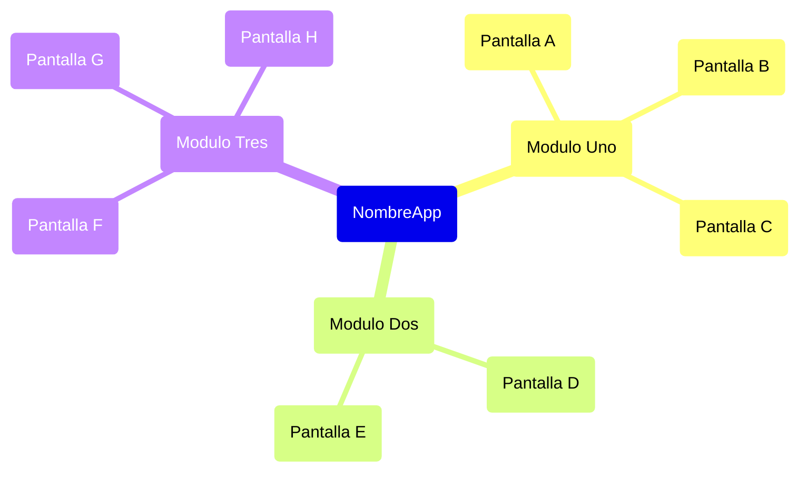
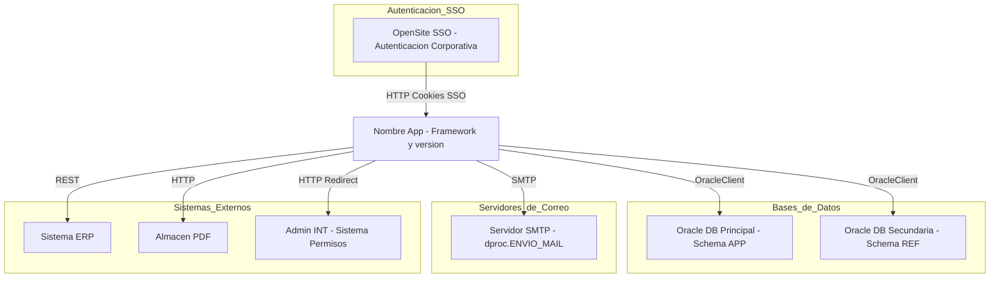

# Prompt de Análisis de Aplicación v2

## Contexto

Estás realizando un **análisis técnico y funcional** de una aplicación para producir un informe estructurado en Markdown. El análisis cubre cuatro dimensiones: descripción funcional, módulos y pantallas, evaluación técnica e integraciones.

El código de la aplicación se encuentra en: `./[NOMBRE_CARPETA]`

Analiza **todas las capas** relevantes: markup, code-behind, controles de usuario, scripts JavaScript, archivos de configuración, y cualquier componente compartido de infraestructura. Una lectura superficial de la estructura del menú no es suficiente — debes rastrear cada página con la profundidad necesaria para describir qué hace realmente.

---

## Tipos de Pantalla

Usa **únicamente** los siguientes valores al clasificar pantallas visibles por el usuario.

| Tipo | Descripción |
|------|-------------|
| `Lectura` | Pantalla que solo muestra datos, sin entrada ni modificación |
| `Lectura / Escritura` | Pantalla que permite crear, editar, eliminar o ejecutar acciones sobre datos |

---

## Instrucciones de Análisis

### Paso 1 — Mapear la Estructura del Código Base

Construye una imagen completa del proyecto antes de analizar páginas individuales. Identifica:

- **Artefactos de navegación:** archivos de sitemap, master pages, menús hardcodeados, configuraciones de menú basadas en roles.
- **Archivos de página:** todas las páginas y sus code-behind. Cuenta el total de archivos y páginas navegables.
- **Controles reutilizables:** controles de usuario y componentes compartidos.
- **JavaScript:** archivos `.js` propios y de terceros, scripts inline significativos. Distingue explícitamente entre scripts desarrollados para la app y librerías de terceros embebidas (jQuery, Bootstrap JS, FusionCharts, etc.).
- **CSS:** hojas de estilo propias y de terceros embebidas (Bootstrap CSS, etc.).
- **Infraestructura compartida:** clases base, helpers, manejadores HTTP, servicios web, configuración global.
- **Conteo de LOC por tipo:** Al mapear cada grupo de archivos, cuenta las líneas de código. Separa siempre el código propio del código de terceros embebido. Esto alimentará directamente la tabla de métricas LOC del informe.

### Paso 2 — Análisis Profundo de Cada Página

Para cada página relevante, analiza:

- **Markup y lógica:** controles de servidor presentes, operaciones en Page_Load y event handlers, lectura/escritura de datos, chequeos de permisos.
- **Controles embebidos:** responsabilidad de cada control de usuario, si es compartido con otras páginas.
- **JavaScript:** qué hace cada script incluido, llamadas AJAX a endpoints, lógica de negocio del lado del cliente.
- **Integraciones externas:** si la página llama a sistemas externos, cómo se hace (web service, HTTP API, DB link, archivo), qué datos fluyen.

### Paso 3 — Identificar Módulos Funcionales

Un **Módulo** es una agrupación de nivel superior de funcionalidad relacionada (equivalente a un ítem de menú principal). Para cada módulo, determina su nombre y una descripción de negocio (máximo 2 oraciones) explicando qué dominio cubre y quién lo usa.

### Paso 4 — Identificar Pantallas por Módulo

Para cada pantalla dentro de un módulo, determina:
- Su **nombre** (etiqueta de UI o nombre derivado).
- Una **descripción** (máximo 30–40 palabras) de qué hace desde la perspectiva del usuario: qué datos muestra o permite ingresar, qué acciones principales tiene. No incluyas componentes internos, validaciones técnicas ni detalles de implementación.
- Su **Tipo**: `Lectura` o `Lectura / Escritura`.

### Paso 5 — Validar Cobertura

Antes de finalizar, verifica:
- Cada archivo de página está contabilizado bajo algún módulo.
- No existen páginas huérfanas. Si existen, agrúpalas bajo **`[SIN ENLACE]`** y nota que pueden estar deprecadas o ser páginas auxiliares/pop-up.

---

## Formato de Salida

Produce el informe completo en Markdown. El documento debe comenzar con un **índice linkeable** que apunte a todas las secciones y subsecciones, seguido del contenido.

**Archivo de salida:** `resumen_as-is_[NOMBRE_APP].md`

---

### Índice

1. [Sección 1: Descripción Funcional](#sección-1-descripción-funcional)
   - [1.1 Propósito de la Aplicación](#11-propósito-de-la-aplicación)
   - [1.2 Tipos de Usuario](#12-tipos-de-usuario)
2. [Sección 2: Módulos Funcionales y Pantallas](#sección-2-módulos-funcionales-y-pantallas)
   - [2.1 Mapa de Navegación](#21-mapa-de-navegación)
   - [2.2 Resumen de Módulos](#22-resumen-de-módulos)
   - [2.3 Inventario de Módulos y Pantallas](#23-inventario-de-módulos-y-pantallas)
3. [Sección 3: Evaluación Técnica](#sección-3-evaluación-técnica)
   - [3.1 Stack Tecnológico](#31-stack-tecnológico)
   - [3.2 Métricas de Código](#32-métricas-de-código)
   - [3.3 Librerías y Dependencias](#33-librerías-y-dependencias)
   - [3.4 Arquitectura](#34-arquitectura)
   - [3.5 Integraciones](#35-integraciones)
4. [Sección 4: Complejidad de la Aplicación](#sección-4-complejidad-de-la-aplicación)

---

### Sección 1: Descripción Funcional

#### 1.1 Propósito de la Aplicación

Párrafo de 3–5 oraciones describiendo qué es el sistema, qué problema resuelve, a qué organización o área pertenece, y cuál es su alcance principal.

#### 1.2 Tipos de Usuario

Identifica los posibles tipos de usuario a partir de la estructura de módulos, nombres de menú, chequeos de permisos y cualquier referencia explícita a roles en el código. Produce una tabla con los roles identificados.

| Rol | Descripción |
|-----|-------------|
| [Nombre del rol] | [Descripción breve: qué hace este usuario en el sistema, máximo 2 oraciones.] |
| ... | ... |

---

### Sección 2: Módulos Funcionales y Pantallas

#### 2.1 Mapa de Navegación

Genera un diagrama `mindmap` en Mermaid que represente la jerarquía completa de la aplicación: raíz con el nombre de la app, ramas de primer nivel para cada módulo, y hojas para cada pantalla dentro del módulo.

**Instrucciones para el mindmap:**

1. La raíz es el nombre de la aplicación
2. Cada rama de primer nivel es un módulo
3. Cada hoja es una pantalla del módulo
4. Nombres cortos y sin caracteres especiales: sin `\`, `{}`, `*`, `—`, `–`, `://`, ni corchetes anidados
5. NO usar comillas en los nodos

**Instrucciones para el mindmap:**

1. La raíz es el nombre de la aplicación con sintaxis `root(NombreApp)`
2. Usar sintaxis `()` en todos los nodos — módulos y pantallas — para renderizarlos como cápsulas sin subrayado
3. Nombres cortos y sin caracteres especiales: sin `\`, `{}`, `*`, `—`, `–`, `://`, ni corchetes anidados
4. NO usar comillas en ningún nodo

**Ejemplo:**

#### 2.2 Resumen de Módulos

Antes del inventario detallado, produce primero una tabla de indicadores globales y luego una tabla consolidada con todos los módulos identificados.

**Tabla de indicadores globales:**

| INDICADOR | VALOR |
|-----------|-------|
| Total módulos funcionales | [N] |
| Total pantallas | [N] |
| Pantallas Lectura / Escritura | [N] |
| Pantallas solo Lectura | [N] |

**Tabla de módulos:**

| MÓDULO | PANTALLAS | LECTURA / ESCRITURA | SOLO LECTURA | TIPOS DE USUARIO |
|--------|-----------|---------------------|--------------|-----------------|
| [Nombre del módulo] | [N] | [N] | [N] | [Rol(es) que lo utilizan] |
| ... | ... | ... | ... | ... |
| **Total** | **N** | **N** | **N** | |

#### 2.3 Inventario de Módulos y Pantallas

Para cada módulo, usa el siguiente formato:

---

**Módulo: [Nombre del Módulo]**

> [Descripción del módulo: propósito de negocio y perfil de usuario que lo utiliza. Máximo 2 oraciones.]

| Pantalla | Descripción | Tipo |
|----------|-------------|------|
| [Nombre pantalla] | [Descripción funcional en máximo 30–40 palabras: qué ve o hace el usuario en esta pantalla.] | `Lectura` |
| ... | ... | ... |

---

*(Repite el bloque anterior para cada módulo identificado)*

---

### Sección 3: Evaluación Técnica

#### 3.1 Stack Tecnológico

| Componente | Tecnología | Versión | Estado | Fin de Soporte |
|------------|------------|---------|--------|----------------|
| Framework | ... | ... | 🔴 Obsoleto | ... |
| Lenguaje | ... | ... | 🟡 Deprecado | ... |
| Base de Datos | ... | ... | 🟢 Vigente | ... |
| Servidor Web | ... | ... | ... | ... |

**Leyenda:** 🔴 EOL (End of Life) | 🟡 Deprecado | 🟢 Vigente/Soportado

#### 3.2 Métricas de Código

| Métrica | Valor |
|---------|-------|
| Archivos de Código | ... |
| Páginas / Pantallas | ... |

**Líneas de Código (LOC):**

Desglosa el conteo de líneas separando claramente el código propio de la aplicación del código de terceros embebido. Para cada tipo, indica qué archivos o patrones se usaron para contarlo.

| Tipo | LOC | Detalle |
|------|-----|---------|
| Server-Side (código propio) | ... | Ej: archivos .aspx.cs / .aspx.vb / .asp — lógica de negocio y presentación |
| Clases compartidas / App_Code | ... | Ej: helpers, clases base, acceso a datos compartido |
| Markup (páginas) | ... | Ej: archivos .aspx / .asp / .html — estructura de páginas |
| JavaScript Propio | ... | Scripts desarrollados para la app (excluye librerías de terceros) |
| JavaScript Terceros | ... | Ej: jQuery x.x, Bootstrap JS, FusionCharts — deprecado si aplica |
| CSS | ... | Hojas de estilo (propias y/o embebidas de terceros) |
| **Total en Proyecto** | **...** | Incluye todo el código (propio + terceros) |

**Nota:** Indica qué porcentaje del total corresponde a código de terceros embebido, y si alguna librería embebida está obsoleta o requiere reemplazo.

#### 3.3 Librerías y Dependencias

| Librería | Versión | Estado | Reemplazo Sugerido |
|----------|---------|--------|-------------------|
| ... | ... | 🔴 EOL | ... |
| ... | ... | 🟡 Deprecado | ... |

**Leyenda:** 🔴 Requiere acción urgente | 🟡 Requiere evaluación | 🟢 Sin acción requerida

#### 3.4 Arquitectura

Descripción de la arquitectura del sistema: patrón utilizado (monolítico, capas, microservicios, etc.), separación de responsabilidades, patrones identificados (MVC, Code-behind, Spaghetti, etc.), y cualquier característica arquitectónica relevante.

**Diagrama de Arquitectura (Mermaid):**

Generar **únicamente** un diagrama en formato Mermaid que muestre:
- La aplicación central con su framework
- Todas las integraciones externas, agrupadas por tipo en subgraphs
- Las bases de datos con su motor y schema

**Instrucciones para el diagrama:**

1. **Layout vertical:** Usar `graph TB` (Top-to-Bottom)
2. **Agrupar por tipo de sistema:** Crear un subgraph por cada categoría de integración. Ejemplos de categorías:
   - Bases_de_Datos — Oracle, SQL Server, MySQL, etc.
   - Autenticacion_SSO — OpenSite, LDAP, AD, etc.
   - Servidores_de_Correo — SMTP, Exchange, etc.
   - Sistemas_Externos — APIs HTTP, sistemas externos, portales web, etc.
   - Almacenamiento — sistemas de archivos, FTP, S3, etc.
3. **Máximo 5 nodos por subgraph:** Si una categoría tiene más de 5 elementos, divídela en dos subgraphs numerados (ej: Bases_de_Datos_1, Bases_de_Datos_2).
4. **Nombres cortos en nodos:** Máximo 2 líneas de texto por nodo.
5. **Estructura en capas verticales:**
   - Capa 1: Aplicación (1 nodo central)
   - Capa 2+: Subgraphs por categoría de integración
6. **Protocolo en las conexiones:** Indicar el protocolo/tecnología en las flechas (REST, SMTP, OracleClient, LDAP, HTTP, etc.)
7. **NO generar diagrama ASCII**, solo Mermaid

**Ejemplo:**

#### 3.5 Integraciones

| # | Sistema Externo | Tipo | Criticidad | Origen | Destino | Frecuencia | Propósito |
|---|-----------------|------|------------|--------|---------|------------|-----------|
| 1 | ... | API/BD Directa/Email/Archivo/SSO | 🔴 Alta | ... | ... | Tiempo real/Evento/Ad-hoc | ... |

**Tipos de integración:** `API` — REST/SOAP/HTTP | `BD Directa` — conexión directa a BD | `Email` — SMTP/servicio de correo | `Archivo` — intercambio de archivos | `SSO` — autenticación centralizada

---

### Sección 4: Complejidad de la Aplicación

**Clasificación:** 🔴 Alta / 🟡 Media / 🟢 Baja

**Justificación:** Párrafo breve (2–3 oraciones) que consolide los factores críticos identificados en las secciones anteriores (stack, dependencias, integraciones, arquitectura, lógica de negocio).

> Ejemplo: "El sistema presenta alta complejidad por stack obsoleto (EOL desde 2011), vulnerabilidades críticas de seguridad, arquitectura monolítica sin separación de capas, y 6 integraciones activas con sistemas externos."

| Factor | Nivel | Justificación |
|--------|-------|---------------|
| Stack Tecnológico | 🔴/🟡/🟢 | ... |
| Dependencias | 🔴/🟡/🟢 | ... |
| Integraciones | 🔴/🟡/🟢 | ... |
| Arquitectura | 🔴/🟡/🟢 | ... |
| Lógica de Negocio | 🔴/🟡/🟢 | ... |

---

## Restricciones de Formato

### Diagramas Mermaid

- **Nodos sin comillas dobles:** Usar siempre `NODE[label]` sin comillas — NO `NODE["label"]`
- **Labels sin caracteres especiales:** Los labels de nodos NO deben contener: `\`, `{}`, `*`, `—`, `–`, URLs con `://`, ni corchetes anidados `[]`
- **Edge labels simples:** `-->|texto simple|` sin paréntesis ni caracteres especiales
- **Nombres de subgraph sin espacios:** Usar guión bajo en lugar de espacios — ej: `subgraph Bases_de_Datos` (NO `subgraph "Bases de Datos"`)
- **Mindmap:** mismas reglas aplican — sin comillas, sin caracteres especiales en los nodos

### Texto General y Tablas

- **Sin etiquetas HTML crudas** en ningún contexto — NO usar etiquetas iframe, style, div, span, etc.
- Si necesitas referenciar una etiqueta HTML, escribirla como texto plano sin los signos menor-que y mayor-que

---

## Instrucciones de Ejecución

1. **Analiza primero, escribe después**: No produzcas ninguna salida hasta completar el análisis completo de todos los archivos relevantes.
2. **Descripciones de pantallas claras y acotadas**: Máximo 30–40 palabras por pantalla, desde la perspectiva del usuario. Omite componentes internos, validaciones técnicas y detalles de implementación. Solo incluye pantallas visibles en la UI.
3. **Basa las observaciones en el código**: No hagas suposiciones sobre funcionalidades que no estén respaldadas por evidencia en el código fuente.
4. **Mantén consistencia**: Usa los mismos nombres de módulo consistentemente a través de todo el informe (el mindmap y el inventario deben usar exactamente los mismos nombres).
5. **Emojis de criticidad obligatorios**: 🔴 Alto/Crítico/EOL | 🟡 Medio/Deprecado | 🟢 Bajo/Vigente
6. **Cumplir siempre las restricciones de formato** definidas en la sección anterior — especialmente en diagramas Mermaid y referencias a HTML.
