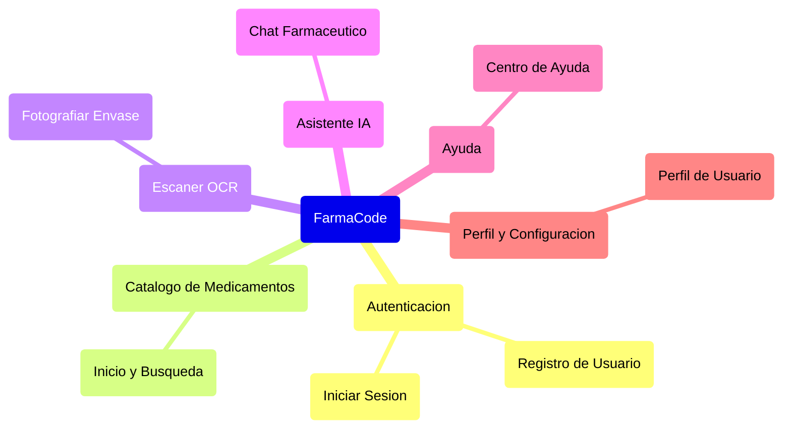
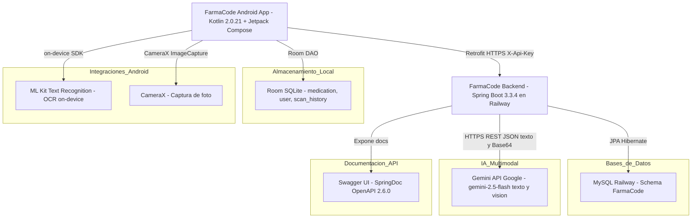

# Informe de Análisis As-Is — FarmaCode

> Rama analizada: `antoniochihuailaf` — último commit: `bebada7 fix: mostrar dosis correcta del envase escaneado en OCR`

## Índice

1. [Sección 1: Descripción Funcional](#sección-1-descripción-funcional)
   - [1.1 Propósito de la Aplicación](#11-propósito-de-la-aplicación)
   - [1.2 Tipos de Usuario](#12-tipos-de-usuario)
2. [Sección 2: Módulos Funcionales y Pantallas](#sección-2-módulos-funcionales-y-pantallas)
   - [2.1 Mapa de Navegación](#21-mapa-de-navegación)
   - [2.2 Resumen de Módulos](#22-resumen-de-módulos)
   - [2.3 Inventario de Módulos y Pantallas](#23-inventario-de-módulos-y-pantallas)
3. [Sección 3: Evaluación Técnica](#sección-3-evaluación-técnica)
   - [3.1 Stack Tecnológico](#31-stack-tecnológico)
   - [3.2 Métricas de Código](#32-métricas-de-código)
   - [3.3 Librerías y Dependencias](#33-librerías-y-dependencias)
   - [3.4 Arquitectura](#34-arquitectura)
   - [3.5 Integraciones](#35-integraciones)
4. [Sección 4: Complejidad de la Aplicación](#sección-4-complejidad-de-la-aplicación)

---

## Sección 1: Descripción Funcional

### 1.1 Propósito de la Aplicación

FarmaCode es una aplicación móvil Android orientada al público general en Chile que permite buscar, identificar y comparar medicamentos bioequivalentes certificados por el Instituto de Salud Pública (ISP). Resuelve el problema del desconocimiento sobre alternativas genéricas de menor costo para un mismo principio activo, permitiendo al usuario fotografiar el envase de un medicamento para obtener instantáneamente alternativas equivalentes. El sistema está compuesto por una app Android (Kotlin + Jetpack Compose) conectada vía Retrofit a una API REST backend (Spring Boot + MySQL desplegada en Railway) que integra la API de Gemini (Google) para reconocimiento de texto OCR e identificación visual de medicamentos. Su alcance principal abarca búsqueda textual, captura OCR de envases con cámara, historial de escaneos y asistencia conversacional básica.

### 1.2 Tipos de Usuario

| Rol | Descripción |
|-----|-------------|
| Usuario Registrado | Persona que crea una cuenta local en la app para buscar medicamentos por nombre o fotografiar su envase, consultar alternativas bioequivalentes, revisar su historial de escaneos y usar el asistente de chat. Es el único rol activo en el sistema actual. |
| Usuario Anónimo | Perfil no implementado en producción; el backend puede registrar búsquedas sin usuario asociado (historial anónimo), pero la app actual requiere registro local para acceder al contenido. |

---

## Sección 2: Módulos Funcionales y Pantallas

### 2.1 Mapa de Navegación

### 2.2 Resumen de Módulos

**Tabla de indicadores globales:**

| INDICADOR | VALOR |
|-----------|-------|
| Total módulos funcionales | 6 |
| Total pantallas | 7 |
| Pantallas Lectura / Escritura | 5 |
| Pantallas solo Lectura | 2 |

**Tabla de módulos:**

| MÓDULO | PANTALLAS | LECTURA / ESCRITURA | SOLO LECTURA | TIPOS DE USUARIO |
|--------|-----------|---------------------|--------------|-----------------|
| Autenticación | 2 | 2 | 0 | Usuario Registrado |
| Catálogo de Medicamentos | 1 | 1 | 0 | Usuario Registrado |
| Escáner OCR | 1 | 1 | 0 | Usuario Registrado |
| Asistente IA | 1 | 1 | 0 | Usuario Registrado |
| Ayuda | 1 | 0 | 1 | Usuario Registrado |
| Perfil y Configuración | 1 | 1 | 0 | Usuario Registrado |
| **Total** | **7** | **5** | **2** | |

### 2.3 Inventario de Módulos y Pantallas

---

**Módulo: Autenticación**

> Gestiona el acceso a la aplicación mediante registro e inicio de sesión locales (Room/SQLite). Lo utiliza cualquier persona que descargue la app antes de acceder al contenido principal.

| Pantalla | Descripción | Tipo |
|----------|-------------|------|
| Iniciar Sesión | Muestra formulario con campos de correo y contraseña. El usuario ingresa sus credenciales y accede al sistema; incluye enlace a recuperación de contraseña (no implementada) y navegación a registro. | `Lectura / Escritura` |
| Registro de Usuario | Formulario con nombre, correo, contraseña y confirmación. El usuario crea una cuenta local almacenada en Room/SQLite. Al completarse, redirige al inicio de sesión. | `Lectura / Escritura` |

---

**Módulo: Catálogo de Medicamentos**

> Núcleo funcional de la app: permite explorar y filtrar el catálogo de medicamentos certificados ISP, ver el detalle con bioequivalentes y revisar el historial de escaneos recientes. Lo utilizan todos los usuarios autenticados.

| Pantalla | Descripción | Tipo |
|----------|-------------|------|
| Inicio y Búsqueda | Lista de medicamentos con barra de búsqueda por nombre y chips de filtro por categoría terapéutica. Al seleccionar un medicamento se abre un panel con detalle y alternativas bioequivalentes. En la parte superior muestra los últimos 10 escaneos realizados con opción de eliminarlos. | `Lectura / Escritura` |

---

**Módulo: Escáner OCR**

> Permite identificar un medicamento fotografiando su envase con la cámara. ML Kit extrae el texto del envase en el dispositivo y lo envía al backend, donde Gemini (Google) interpreta la información y devuelve los bioequivalentes disponibles.

| Pantalla | Descripción | Tipo |
|----------|-------------|------|
| Fotografiar Envase | Activa la cámara trasera del dispositivo para tomar una foto del envase de un medicamento. ML Kit TextRecognition extrae el texto localmente; ese texto (y opcionalmente la imagen en Base64) se envía al backend vía Retrofit. El resultado muestra el medicamento identificado y sus alternativas bioequivalentes. | `Lectura / Escritura` |

---

**Módulo: Asistente IA**

> Chat conversacional que responde consultas sobre medicamentos, principios activos, alternativas genéricas y certificación ISP. Las respuestas se procesan localmente con lógica de palabras clave; no consume el backend ni Gemini directamente desde el cliente.

| Pantalla | Descripción | Tipo |
|----------|-------------|------|
| Chat Farmacéutico | Interfaz de mensajería donde el usuario escribe consultas en lenguaje natural. El asistente responde con información sobre medicamentos, alternativas y certificación ISP mediante reglas de palabras clave. Los mensajes se muestran en burbujas diferenciadas por origen. | `Lectura / Escritura` |

---

**Módulo: Ayuda**

> Sección informativa que orienta al usuario en el uso de la app y explica términos farmacéuticos clave. No requiere interacción más allá del desplazamiento.

| Pantalla | Descripción | Tipo |
|----------|-------------|------|
| Centro de Ayuda | Muestra guía paso a paso sobre búsqueda, escaneo, visualización de alternativas y verificación ISP. Incluye glosario con definiciones de genérico, bioequivalente, referencia y principio activo, y aviso legal sobre uso informativo. | `Lectura` |

---

**Módulo: Perfil y Configuración**

> Muestra los datos del usuario autenticado y concentra los controles de personalización de la app: tema visual, tamaño de fuente, idioma y cierre de sesión.

| Pantalla | Descripción | Tipo |
|----------|-------------|------|
| Perfil de Usuario | Presenta nombre y correo del usuario. Ofrece accesos a Historial (redirige al Catálogo) y Ayuda. Permite activar modo oscuro, notificaciones y acceder al diálogo de configuración global donde se cambia el tamaño de fuente y el idioma (Español/English). Incluye botón de cierre de sesión. | `Lectura / Escritura` |

---

## Sección 3: Evaluación Técnica

### 3.1 Stack Tecnológico

| Componente | Tecnología | Versión | Estado | Fin de Soporte |
|------------|------------|---------|--------|----------------|
| Framework Backend | Spring Boot | 3.3.4 | 🟢 Vigente | Nov 2025 (OSS) |
| Lenguaje Backend | Java | 21 (LTS) | 🟢 Vigente | Sep 2031 |
| UI Framework Mobile | Jetpack Compose (Material3) | BOM reciente | 🟢 Vigente | Activo |
| Lenguaje Mobile | Kotlin | 2.0.21 | 🟢 Vigente | Activo |
| ORM / Persistencia Backend | Spring Data JPA + Hibernate | 6.x | 🟢 Vigente | Activo |
| Base de Datos Backend | MySQL (Railway) | No especificada | 🟢 Vigente | Depende de versión |
| Base de Datos Local Android | Room (SQLite) | v2 (schema) | 🟢 Vigente | Activo |
| IA / Multimodal | Gemini API (gemini-2.5-flash) | Google | 🟢 Vigente | Activo |
| OCR On-device | ML Kit Text Recognition | Último estable | 🟢 Vigente | Activo |
| Acceso a Cámara | CameraX (ImageCapture + Preview) | Último estable | 🟢 Vigente | Activo |
| Cliente HTTP Android | Retrofit 2 + OkHttp 4 | Último estable | 🟢 Vigente | Activo |
| Despliegue Backend | Railway | Cloud PaaS | 🟢 Vigente | Activo |
| Documentación API | SpringDoc OpenAPI (Swagger UI) | 2.6.0 | 🟢 Vigente | Activo |
| Reducción de Boilerplate | Lombok | Gestionado por Spring Boot | 🟢 Vigente | Activo |

### 3.2 Métricas de Código

| Métrica | Valor |
|---------|-------|
| Archivos de Código Fuente | ~65 archivos (34 Java backend + 31 Kotlin frontend) |
| Pantallas / Screens | 7 pantallas navegables |
| Módulos Funcionales | 6 |
| Endpoints REST Backend | 7 (3 Medicamentos + 2 Búsqueda + 2 Historial) |
| Entidades de Base de Datos | 6 tablas MySQL + 3 tablas Room (medication, user, scan_history) |
| Tablas Room (Android local) | 3 (medication, user, scan_history) |

**Líneas de Código (LOC):**

| Tipo | LOC | Detalle |
|------|-----|---------|
| Backend Server-Side (Java) | 2,366 | Controllers (3), Services (4 incl. GeminiApiService), Entities (7), Repositories (6), DTOs (6), Config y Exceptions (5), ApiKeyFilter |
| Recursos Backend | ~160 | schema.sql (107), application.properties (53), data.sql (est.) |
| Frontend Pantallas (Kotlin Compose) | ~2,000 | 7 archivos de Screen (incl. ScannerScreen reescrito con OCR + PhotoCameraPreview) |
| Frontend ViewModels y Capa de Datos (Kotlin) | ~2,121 | 6 ViewModels, DAOs (3 incl. ScanHistoryDao), Repositories, Entities Room (3 incl. ScanHistory), Red (RetrofitClient, BusquedaApiService, DTOs), Navigation, Theme, App, MainActivity |
| **Total en Proyecto** | **~6,647** | Todo código propio — sin librerías de terceros embebidas en el código fuente |

**Nota:** El 100% del código fuente es propio del proyecto. Las librerías (Compose, Room, Retrofit, ML Kit, etc.) se referencian como dependencias Gradle/Maven y no están embebidas en el código fuente.

### 3.3 Librerías y Dependencias

| Librería | Versión | Estado | Reemplazo Sugerido |
|----------|---------|--------|-------------------|
| Spring Boot | 3.3.4 | 🟢 Vigente | — |
| springdoc-openapi-starter-webmvc-ui | 2.6.0 | 🟢 Vigente | — |
| Kotlin | 2.0.21 | 🟢 Vigente | — |
| Jetpack Compose BOM | Reciente | 🟢 Vigente | — |
| Room (SQLite) | v2 | 🟢 Vigente | — |
| CameraX | Último estable | 🟢 Vigente | — |
| ML Kit Text Recognition | Último estable | 🟢 Vigente | — |
| Retrofit 2 | Último estable | 🟢 Vigente | — |
| OkHttp 4 + Logging Interceptor | Último estable | 🟢 Vigente | — |
| Gson Converter (Retrofit) | Último estable | 🟢 Vigente | — |
| Lombok | Gestionado por Spring Boot | 🟢 Vigente | — |
| KSP (Kotlin Symbol Processing) | 2.0.21-1.0.27 | 🟢 Vigente | — |
| mysql-connector-j | Gestionado por Spring Boot 3.3.4 | 🟢 Vigente | — |
| Jackson Databind | Gestionado por Spring Boot | 🟢 Vigente | — |

**Leyenda:** 🔴 Requiere acción urgente | 🟡 Requiere evaluación | 🟢 Sin acción requerida

No se detectaron dependencias EOL ni deprecadas. La Claude API permanece referenciada en `application.properties` pero está desactivada — el backend usa exclusivamente Gemini en producción.

### 3.4 Arquitectura

La aplicación sigue una **arquitectura cliente-servidor de dos capas** donde el cliente es una aplicación Android nativa y el servidor es una API REST desplegada en Railway (cloud PaaS).

**Frontend (Android):** implementa el patrón **MVVM (Model-View-ViewModel)** con Jetpack Compose. Las pantallas (Composables) observan el estado mediante `StateFlow`, los ViewModels contienen la lógica de presentación y orquestan las llamadas al repositorio y a la red. La capa de datos se divide en: Room DAOs (almacenamiento local), Repositories (fachada unificada) y una capa de red con Retrofit + OkHttp para consumir la API REST del backend. El escáner OCR captura una foto con CameraX, extrae texto localmente con ML Kit TextRecognition y envía el resultado al backend.

**Backend (Spring Boot):** arquitectura en **tres capas** (Controller → Service → Repository) con separación clara de responsabilidades. Los Controllers exponen los endpoints REST protegidos por `ApiKeyFilter` (header `X-Api-Key`). Los Services contienen la lógica de negocio, delegando a `GeminiApiService` para identificación de principio activo (texto) y extracción estructurada desde OCR o imagen (Vision multimodal). Los Repositories abstraen el acceso a MySQL mediante Spring Data JPA. Se utilizan DTOs para desacoplar la presentación de las entidades JPA.

**Despliegue:** el backend y MySQL están desplegados en Railway; la app Android apunta a `https://farmacode-production-c60c.up.railway.app/`.

**Diagrama de Arquitectura:**

### 3.5 Integraciones

| # | Sistema Externo | Tipo | Criticidad | Origen | Destino | Frecuencia | Propósito |
|---|-----------------|------|------------|--------|---------|------------|-----------|
| 1 | Gemini API (Google) | API | 🔴 Alta | Backend Railway | generativelanguage.googleapis.com | Por cada escaneo OCR y búsqueda manual | Extraer información estructurada de texto OCR (nombre, principio activo, dosis, lab, país), analizar imagen Base64 si el OCR es insuficiente, e identificar principio activo desde nombre comercial |
| 2 | MySQL (Railway) | BD Directa | 🔴 Alta | Backend Spring Boot | MySQL Railway | Tiempo real | Almacenamiento y consulta del catálogo de medicamentos, laboratorios, precios e historial de búsquedas |
| 3 | Room SQLite (Android) | BD Directa | 🔴 Alta | Android App | Dispositivo local | Tiempo real | Almacenamiento local del catálogo precargado, usuarios registrados e historial de los últimos 10 escaneos |
| 4 | ML Kit Text Recognition | API | 🔴 Alta | Android App | Google SDK on-device | Por cada foto del escáner | OCR local del envase del medicamento — extrae texto antes de enviarlo al backend |
| 5 | CameraX (Google) | API | 🟡 Media | Android App | Google SDK on-device | Durante uso del escáner | Captura de foto (ImageCapture) y preview en tiempo real de la cámara trasera del dispositivo |

**Tipos de integración:** `API` — REST/HTTP | `BD Directa` — acceso directo a BD o SDK local

---

## Sección 4: Complejidad de la Aplicación

**Clasificación:** 🟡 Media

**Justificación:** FarmaCode ha aumentado su complejidad respecto a la versión inicial al incorporar la cadena OCR completa (CameraX → ML Kit on-device → Retrofit → Backend → Gemini Vision), el historial de escaneos persistente y la autenticación por API Key. Si bien el stack sigue siendo moderno y sin dependencias EOL, la dependencia de dos servicios externos de red en el flujo crítico de escaneo (backend Railway + Gemini API) introduce puntos de fallo que requieren manejo de errores cuidadoso en producción.

| Factor | Nivel | Justificación |
|--------|-------|---------------|
| Stack Tecnológico | 🟢 Vigente | Spring Boot 3.x / Java 21 LTS / Kotlin 2.x / Compose Material3 — todo activamente mantenido |
| Dependencias | 🟢 Sin acción | Sin librerías EOL ni deprecadas; Claude API desactivada pero referenciada (limpieza pendiente menor) |
| Integraciones | 🟡 Media | 5 integraciones activas; el flujo de escaneo encadena ML Kit on-device + Retrofit HTTPS + Gemini Vision, con dos puntos de fallo externos en el camino crítico |
| Arquitectura | 🟢 Limpia | MVVM frontend con capa de red separada; capas Controller-Service-Repository en backend; ApiKeyFilter como capa de seguridad; DTOs bien definidos |
| Lógica de Negocio | 🟡 Media | El flujo OCR involucra extracción de texto on-device, limpieza, envío al backend, extracción estructurada con Gemini (con múltiples fallbacks: texto → imagen → N/D) y normalización de mayúsculas |
